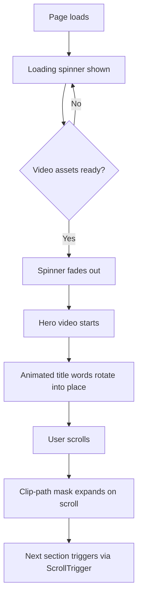

<div align="center">
  <br />
  
  <br />
  <br />

  <div>
    
    
    
  </div>
</div>

<h1 align="center">Awwwards-Style Website</h1>

A recreation of [Zentry's](https://zentry.com/) landing page, built to practice scroll-driven animation and the kind of layered, story-led layout you usually see in Awwwards-winning sites. This isn't a from-scratch design — it's me reverse-engineering an existing site to understand how the motion and structure actually work.

## Why I built this

I wanted to get comfortable with GSAP beyond basic fade-ins — things like scroll-triggered timelines, clip-path transitions, and tying video playback to scroll position. Zentry's site does all of that really well, so I used it as a reference and rebuilt the pieces myself in React.

## Stack

- **React** for the component structure
- **Tailwind CSS** for styling
- **GSAP** (with `@gsap/react`) for animation and scroll triggers
- **Vite** as the dev server / bundler

## What's in it

- Scroll-triggered animations across sections
- Clip-path based geometric transitions (the bento-style cards)
- 3D-ish hover interactions on the feature cards
- Video woven into the storytelling sections, not just decorative
- Responsive across screen sizes
- Components split out and reusable rather than one giant page file

## Running it locally

You'll need [Git](https://git-scm.com/), [Node.js](https://nodejs.org/en), and npm installed.

```bash
git clone https://github.com/i-dont-know-45/awwwards-website
cd awwwards-website
npm install
npm run dev
```

Then open [http://localhost:5173](http://localhost:5173).

## Project structure

```
src/
├── components/
│   ├── Hero.jsx          # landing section, video + animated heading
│   ├── About.jsx
│   ├── Features.jsx      # bento-grid feature cards with hover effects
│   ├── Story.jsx         # clip-path image section
│   ├── Contact.jsx
│   ├── Navbar.jsx
│   ├── Footer.jsx
│   ├── AnimatedTitle.jsx
│   ├── Button.jsx
│   └── RoundedCorners.jsx
├── App.jsx
├── main.jsx
└── index.css
```

## A few snippets worth pointing out

<details>
<summary>Clip-path shapes (index.css)</summary>

These utility classes drive most of the geometric section transitions — the angled image masks, the contact section shapes, and the hero clip-path reveal.

```css
.swordman-clip-path {
  clip-path: polygon(16% 0, 89% 15%, 75% 100%, 0 97%);
}

.contact-clip-path-1 {
  clip-path: polygon(25% 0%, 74% 0, 69% 64%, 34% 73%);
}

.contact-clip-path-2 {
  clip-path: polygon(29% 15%, 85% 30%, 50% 100%, 10% 64%);
}

.mask-clip-path {
  clip-path: polygon(0 0, 100% 0, 100% 100%, 0 100%);
}
```

</details>

<details>
<summary>Animated title word reveal</summary>

Each word in the hero heading starts rotated and offset in 3D space, then settles into place. This is the base state GSAP animates from:

```css
.animated-word {
  @apply font-zentry-regular font-black opacity-0;
  transform: translate3d(10px, 51px, -60px) rotateY(60deg) rotateX(-40deg);
  transform-origin: 50% 50% -150px !important;
  will-change: opacity, transform;
}
```

</details>

<details>
<summary>Loading indicator (three-body spinner)</summary>

A small custom CSS spinner used while the hero video assets load.

```css
.three-body {
  --uib-size: 35px;
  --uib-speed: 0.8s;
  --uib-color: #5d3fd3;
  position: relative;
  display: inline-block;
  height: var(--uib-size);
  width: var(--uib-size);
  animation: spin78236 calc(var(--uib-speed) * 2.5) infinite linear;
}

@keyframes spin78236 {
  0% { transform: rotate(0deg); }
  100% { transform: rotate(360deg); }
}
```

</details>

## How the hero animation flows

Roughly how the entry sequence is wired up, for anyone digging through the GSAP code:



## Assets

Fonts, video, and image assets used in the build are available [here](https://drive.google.com/file/d/12hCVnanOAUmM1vzz2dTWZ_uEFGG8xDcT/view?usp=sharing).

## Disclaimer

Design inspiration is entirely from **[Zentry](https://zentry.com/)** — full credit to them. This repo exists for learning and personal practice, not for commercial use or redistribution. Some fonts and assets in this project belong to Zentry and are used here for educational purposes only; if you fork this for anything public-facing, swap those out for assets you actually own or have rights to. This project has no affiliation with or endorsement from Zentry.
